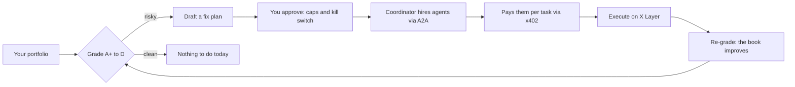

# Second Opinion Pro

### The risk desk that does not just warn you. It fixes it.

Most tools tell you your crypto portfolio is risky and stop there. **Second Opinion
Pro** grades the risk, then hires and pays small AI specialist agents to actually fix
it on **X Layer**, while you hold the limits and the kill switch the whole time.

**▶ Live demo:** https://second-opinion-pro.vercel.app
**Built for:** OKX Dev Day 2026 · Tracks: **OKX AI** (primary) + **X Layer / RWA**

> Try it in 20 seconds: open the link, keep "Demo · at-risk book", press
> **Get a second opinion**, then **Approve plan**, and watch the grade climb from
> **D to A−** while you hold a red kill switch.

---

## What it does



1. **Grade** your on-chain and tokenized-asset portfolio across seven health checks,
   A+ to D. Deterministic and explainable.
2. **Plan** the fixes and map each to a specialist agent.
3. **Act, with your approval:** a coordinator agent hires each specialist (A2A), pays
   it per task (x402), and has it execute on X Layer. The grade climbs live.
4. **Stay in control:** spend caps, an approval toggle, a full audit trail, and a red
   **kill switch** that stops everything instantly.

In the demo, an at-risk book graded **D** becomes **A−** after the desk rotates a
memecoin position into a tokenized blue-chip plus a cash buffer and de-risks a
leveraged perp. Real residual risk is left on the board, and shown honestly.

## The seven health checks

Leverage · Biggest position · Move-together risk · Cash buffer · Spread
(diversification) · Leverage cost · Drop from peak. Each is plain-labelled, has a
one-line explanation, and is scored deterministically. See [`lib/vitals.ts`](lib/vitals.ts)
and the test suite in [`lib/vitals.test.ts`](lib/vitals.test.ts) (`npm run test:vitals`).

## You hold the wheel (the Control Seat)

- **Max agent fees / run** — a hard cap on real payouts to agents.
- **Max single trade** — a size rail on any one action.
- **Require my approval** — nothing moves until you say go.
- **Kill switch** — stop the whole run instantly, book untouched from there.

## What is real, said honestly

We never dress up simulation as reality. Every step in the audit trail is tagged.

- **Real today:** live X Layer connection (the header shows the current block), the
  deterministic grading engine, the specialist agents' real on-chain identities
  (they link to their addresses on OKLink), the fully hosted always-on architecture,
  and all the human-oversight controls.
- **Simulated, and labelled:** the agent hire / pay / execute steps run in a faithful
  simulation flagged `sim`. They become real X Layer transactions the moment a funded
  agent wallet and `LIVE_EXECUTION=true` are set. Nothing else changes.

## The one design rule: no PC required

An earlier version of this idea only worked while a session was open on the builder's
own laptop. When the laptop slept, the agent went dark. Second Opinion Pro is built
the opposite way: the agent brain is serverless, its state lives in a serverless
database, and two independent heartbeats advance work unattended. Close your laptop
and it keeps running.

## How it works

| Layer | What | Where |
|---|---|---|
| Diagnosis | Deterministic seven-vitals grading (A+ to D) | `lib/vitals.ts` |
| Portfolio | Demo books + live X Layer balance read | `lib/portfolio.ts`, `lib/chain.ts` |
| Agent economy | Plan → hire (A2A) → pay (x402) → execute → settle | `lib/agents.ts` |
| Orchestrator | Always-on state machine, guardrails, kill switch | `lib/desk.ts` |
| Chain | X Layer client, agent wallet, on-chain anchoring | `lib/chain.ts` |
| Storage | Redis (Upstash / Vercel KV) or in-memory fallback | `lib/store.ts` |
| API | Serverless routes: scan / approve / tick / kill / chain | `app/api/*` |
| Interface | Instrument-panel UI | `components/desk-ui.tsx` |

Stack: Next.js 14 on Vercel, React, TypeScript, viem, X Layer (chain 196).

## Run locally

```bash
npm install
npm run dev        # http://localhost:3838
npm run test:vitals
```

Runs with zero config in honest simulation mode. See [`.env.example`](.env.example)
for going always-on (Upstash) and live on-chain, and [`DEMO.md`](DEMO.md) for the
demo script.

## More docs

- [`SUBMISSION.md`](SUBMISSION.md) — the full submission writeup.
- [`QA_BRIEF.md`](QA_BRIEF.md) — how to test it, and expected-vs-bug behaviour.
- [`DEMO.md`](DEMO.md) — the demo script.
